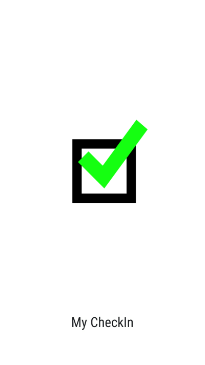
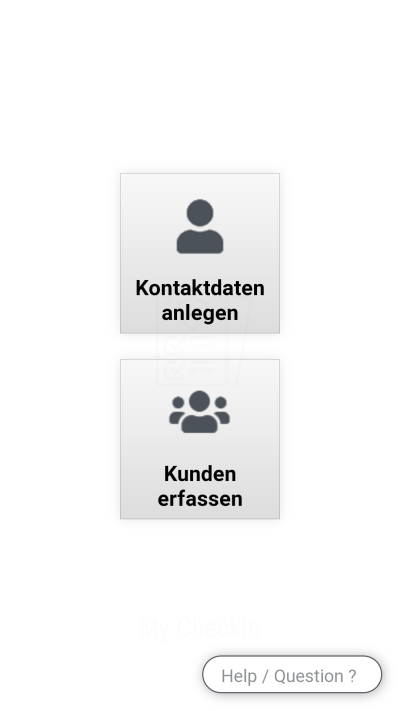
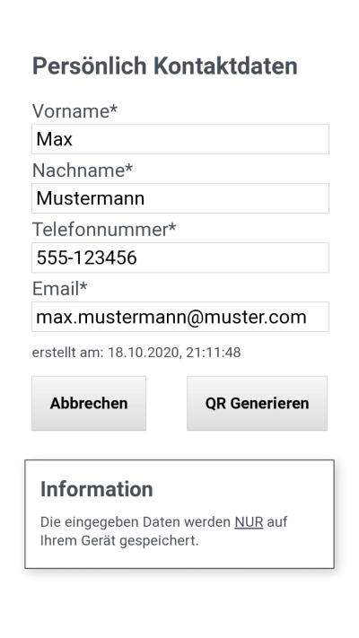
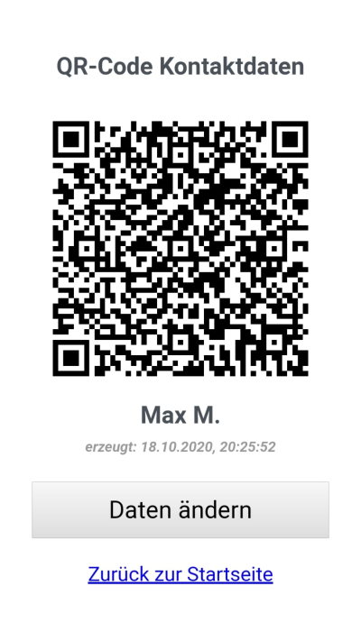
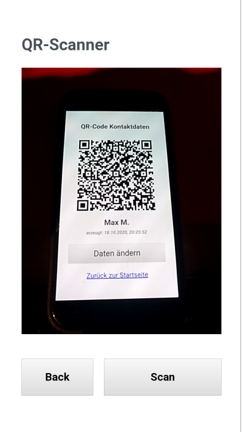
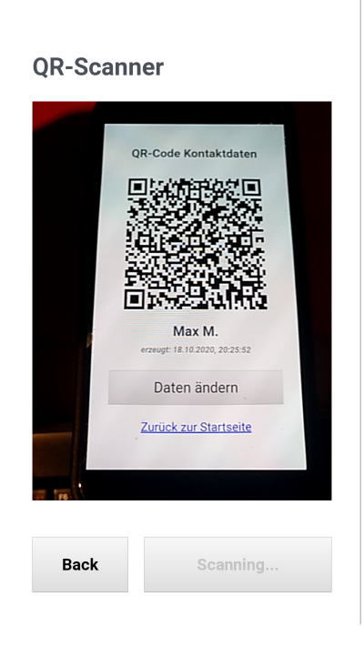
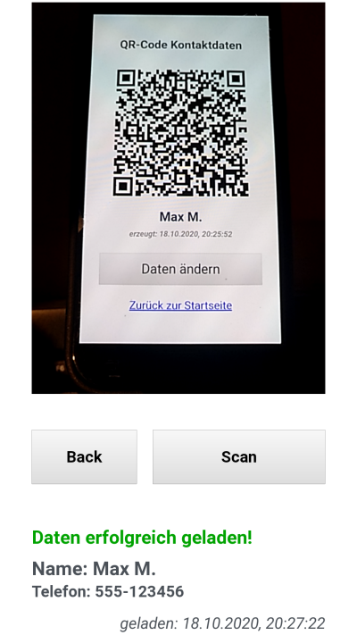
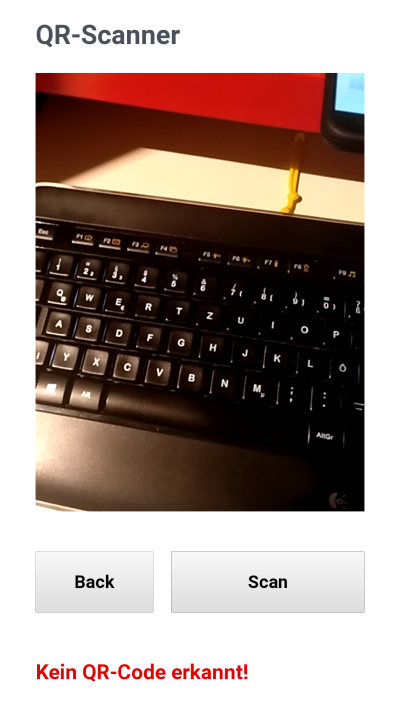

# Screens Overview

## User Part

### Slash Screen
Default PWA Splash Screen, can it be altered / pimped, other than with a Title and an Icon?   
  

### Start Screen
Main Screen where you can select the Mode:
* Customer who "wants" to share his data, with businesses (fast and easy)
* Business that "wants" to register customers  

  

#### Customer Mode: Dataentry Screen
Dataentry screen, if the User never entered Daten, he will be directed to this screen, if he chooses the "Customer Mode" from the App Start Screen.    
After generating the firsttime a QR-Code, the User will be directed to the QR Screen.  
All fields are required  
  

#### Customer Mode: QR Screen
QR screen, if the User has generated already a QR-Code, he will be directed to this screen, if he chooses the "Customer Mode" from the App Start Screen.  
From here the User can enter the update Mode, to alter his data.  
  

#### Business Mode: QR Scan Screen [WIP]
On this screen, generate QR-Codes can be read.  
This feature is still being developed.  

  

  

#### Business Mode: List Scan Screen [No yet Implemented]
On this Screen a list of all customer can be seen.  
The list should be "exportable" and "deletable".  

#### Business Mode: Settings Screen [No yet Implemented]
On this Screen settings for the Business Mode should be set.  