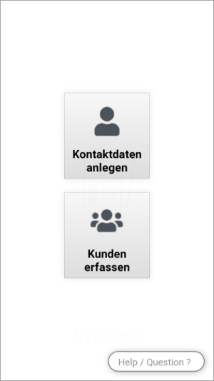
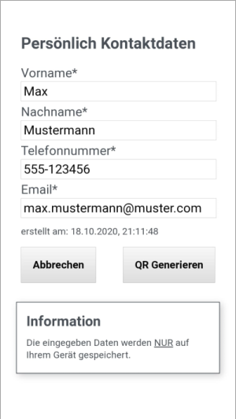

# "My CheckIn": Checkin App for Offline use
## Versionnumber 0.1.0 (2020-10-18)
(***Documentation last update 2020-10-18 20:30***)  

This is a small tool to help with _checking in_ (registering) people, to an Event _local-business_, with ease and no backend.
Data is stored online on the devices, that are used (but it can be exported).

  
_Some Screens from the "Customer Mode"_

## Features

* Works Offline _(tested only on Android)_
* Splash Screen _(Automatic from PWA)_
* User Frontend _(to provide data in an fast and easy Way)_
* Business Frontend (for reading in data)
   * WebCam QR Code Scanner
* Basic Styling

## Roadmap / Future Features
* Info Screen
* Business Frontend
  * Manual entry of customers
  * Save data in a List
   * Export Data
      * Google Spreadsheet
      * CSV
      * ...
* Test for disclaimer and Stuff
* HP to promote this Tool
* _Real tight and slick_ Styling
* Test on Iphone
* Refactoring and Cleanup

## Known Bugs
* layout is sometimes a wonky (scrolling and offset)
* back - history doesn't work 100%

## Usage

This application has to run on an https server, with a valid Certificate, OR may functions like 'service-workers' and 'webcam' won't work.  
There is a script to launch the "https-server" npm module, but you would have to create the needed certificates.

## SourceControl Link & Information
_No Remote Repo created => Not yet Uploaded_ https://github.com/akumagamo/....git

## Documentation

### File / Folder Structure

     +-+- pwa-my-checkin
       +-+- css
       | +--- app.css
       +-+- docs
       | +-+- img                // images for manual.md
       | | +-- ...
       | +-+--- manual.md        // mini Screens overview
       +-+- img
       | +--- business.png
       | +--- user.png
       +-+- js
       | +--- app.js
       | +---qrcode-read.min.js   // external libraries
       | +---qrcode-write.min.js  // external libraries
       +-+- pwa                   
       | +-+-img
       |   +- icon-192v2.png
       |   +- icon-512v2.png
       +-+- readme               // images for reame.md
       | +-- ...
       +- .gitignore
       +- favicon.ico
       +- index.html
       +- LICENSE                 // License for ALL Files EXCEPT the external libraries in the js folder
       +- manifest.json 
       +- package.json
       +- readme.md (this document)
       +- service-worker.js
